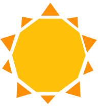

# rayse
  
*Laith Alqaisi - Colby Guan - Henry Kwan - Nathaniel Low - Patrick O’Halloran*  
*UC Berkeley CS160 Spring 2016*   

Rayse is an app for people with Seasonal Affective Disorder that helps its users passively track how much light they’re getting throughout the day. The app sends users encouraging notifications to make sure they’re on track to meet their daily light quota and congratulates users when they meet their goals. Users can also connect Google Calendar with rayse to see how light can be integrated into their schedules.

## Schema
```
User
{
  username: 
  password: 
  track_starts: {
    day: 0-23 hour
    ...
  }
  track_ends: {
    ""
    ...
  }
  goals: {
    day: minutes of light
  }
}
  
Light
{
  userId: 
  date: (Date @ 12AM)
  timeseries: {
    hour: minutes of light
  }
  timeRanges: (unused)
}
```

## Credits
* Sending light data in background as an async task: http://code.tutsplus.com/tutorials/android-barometer-logger-acquiring-sensor-data--mobile-10558
* Date and time stuff: http://stackoverflow.com/questions/1555262/calculating-the-difference-between-two-java-date-instances
* Sensor in service: http://stackoverflow.com/questions/22598314/sensoreventlistener-in-a-service
* LocationBroadcastManager: http://stackoverflow.com/questions/23968240/updating-activity-textview-from-service-using-service-binding
* Weekly calendar library: https://github.com/alamkanak/Android-Week-View
* Getting the user’s calendar events from local calendar app: http://www.developer.com/ws/android/programming/Working-with-the-Android-Calendar-3850276.htm
* Graphics: http://stackoverflow.com/questions/2259476/rotating-a-point-about-another-point-2d
* Convert color int to hex string: http://stackoverflow.com/questions/6539879/how-to-convert-a-color-integer-to-a-hex-string-in-android
* Getting user events from calendar:
http://www.emberex.com/using-androids-built-in-calendarprovider-part-two-retrieving-events/
https://github.com/alamkanak/Android-Week-View
https://github.com/david-laundav/Android-CalendarService
* Periodic notifications: https://guides.codepath.com/android/Starting-Background-Services#using-with-alarmmanager-for-periodic-tasks
* Library for chart creation:
https://github.com/lecho/hellocharts-android
